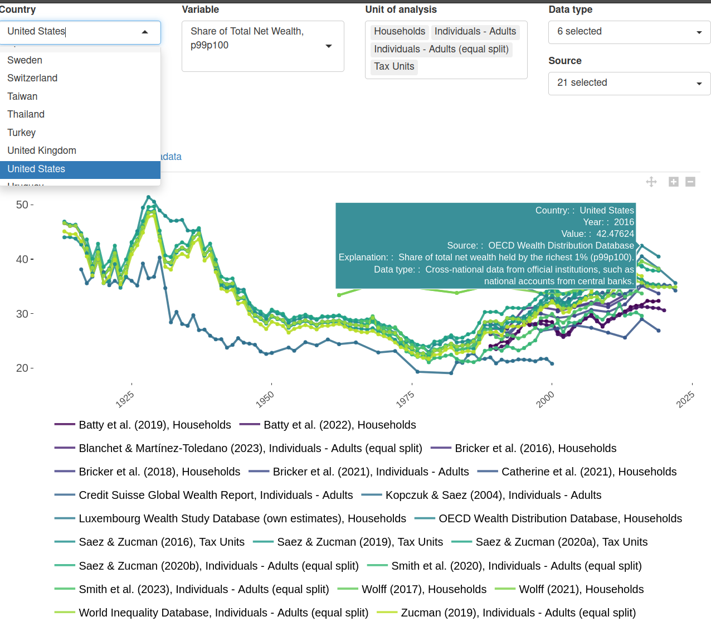
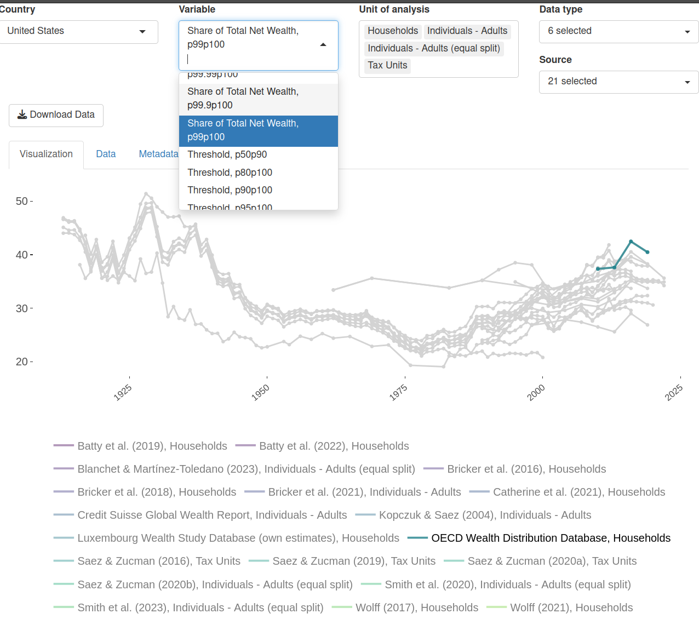

# Data Showroom 

Build interactive visualizations to explore data on your own computer or upload them to a server to embed on a website. The tool is tailored, but not exclusive, to the GC Wealth Data Warehouse (see https://github.com/gcwealthproject/warehouse) 

## Interactive examples

A published interactive version, exploring estimates of wealth concentration in the United States from many sources, is published in the following [link](https://ign-flores.shinyapps.io/rshiny_inht_1/). 

<div align="center">

  
</div>

## Running the app 

```R
library(shiny)
shiny::runApp('GitHub/data-shoroom')
```

## Menu configuration

The application’s menu is fully customizable and defined in a YAML file. This makes it easy to update or modify the menu structure without changing the application code. Simply write a yaml file or edit the [config.yaml](tests/config.yaml).

Below is a simple example for a basic visualization:


```yaml

#define data source
data.file: "data/ineq_warehouse_meta_v1_2.csv"
data.wrangler: "tests/dictionary_loader_ineq.R" #add code to transform the data before plotting if needed 

#combine columns into a string variable if needed 
new.cols: 
  viz_color_var:
    - "legend"
    - "d5_dboard_specific_lab"
  var_per:
    - "d3_vartype_lab"
    - "percentile"

#define plot type 
gopts: 
 - "line"
 - "point"
 
#define main plot variables 
x_var: "year"
y_var: "value"
color_var: "viz_color_var"
```

you can also modify selector variables adding labels and pre-selected values, as well as the display of a data table widget, and the information shown in the tooltip.

```yaml
#Define main selectors 
selector_info:
  GEO_long:
    label: "Country"
    selected:
      - "United States"
  var_per:
    label: "Variable"
    selected: "Share of Total Net Wealth, p99p100"
  d5_dboard_specific_lab:
    label: "Unit of analysis"
    selected:
      - "Individuals - Adults"
      - "Individuals - Adults (equal split)"
      - "Households"
      - "Tax Units"
    multiple: true #necessary if you have more than one 

#Define reactive or 'loose' selectors (react to changes in main selectors)
loose_selectors:
  Data_Type:
    label: "Data type"
    type: "checkbox"
  legend:
    label: "Source"
    type: "checkbox"

#define the columns of the data table widget 
dt.cols:
  GEO: "Country code"
  year: "Year"
  GEO_long: "Country"
  var_per: "Variable"
  d5_dboard_specific_lab: "Unit of Analysis"
  value: "Value"
  viz_color_var: "Source and Unit"
  legend: "Source"
  metadata: "Description"
  data_description: "Metadata"
  Data_Type: "Data type"

#define the information shown in the tooltip
tooltip_vars:
  GEO_long: "Country:"
  year: "Year:"
  value: "Value:"
  legend: "Source:"
  metadata: "Explanation:"
  data_description: "Data type:"
```

Further options include adding a download data button, hiding the selectors and opening ears to listen to messages from Javascript (useful when you want the graph to react to messages from a website if the visualization is embedded)

```yaml
#other options 
download.button: True
hide.selectors: False
listen: False
```

For a fuller configuration, see the [test configuration](tests/config.yaml) file and explore the `createViz()` function.


