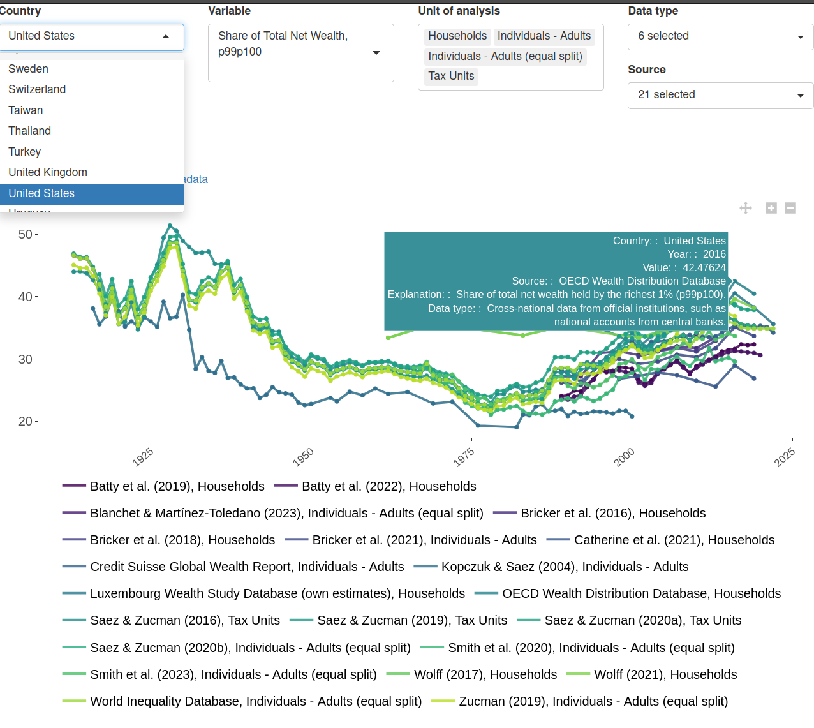
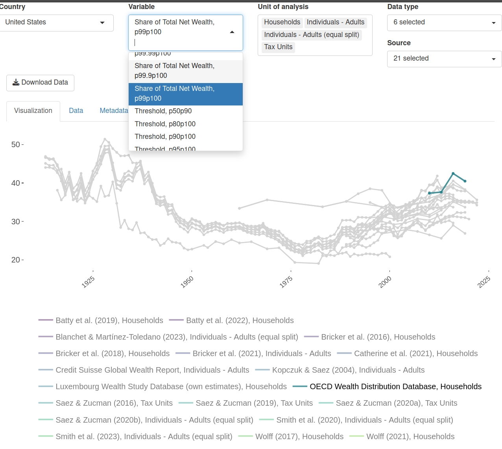

# Data Showroom

`data-showroom` is a configurable Shiny app for turning tabular datasets into reusable, website-friendly interactive dashboards. The app is designed around YAML configuration files, so most new dashboards can be created by swapping data sources, selectors, plot settings, and metadata tables without rewriting the UI.

It is especially geared toward the GC Wealth Data Warehouse ecosystem, but the app itself is more general: it can read `.csv`, `.rds`, and `.qs` datasets, layer in custom preprocessing scripts, and render plots, tables, downloads, and metadata panels from configuration alone.

## What the app supports

- Config-driven dashboards via files in `yaml/`
- Multiple plot modes: line, point, step, area, choropleth map, and animated horizontal bar charts
- Fixed selectors and reactive "loose" selectors generated from data columns
- Optional faceting, extra overlay layers, and area stacking toggle
- Downloadable filtered data tables
- Optional methodological/metadata tables shown in a tab or below the chart
- Embedded mode with JavaScript message listeners for external control

## Screenshots

<div align="center">
  
  
</div>

## Repository layout

```text
.
├── app.R                  # Shiny entrypoint; selects which YAML preset to run
├── deploy-app.R           # shinyapps.io deployment helper
├── modules/               # Core app modules
├── yaml/                  # Dashboard presets
├── custom_code/           # Optional dataset-specific wrangling scripts
├── data/                  # Input data and generated artifacts
└── screenshots/           # README images
```

## Quick start

### 1. Install R packages

There is no `renv` or package manifest in this repo yet, so dependencies are managed manually. For the app itself, install at least:

```r
install.packages(c(
  "bslib",
  "data.table",
  "DT",
  "ggplot2",
  "htmltools",
  "magrittr",
  "paletteer",
  "plotly",
  "qs",
  "readxl",
  "rlang",
  "scales",
  "shiny",
  "shinyWidgets",
  "tictoc",
  "viridis",
  "yaml"
))
```

Some optional data-prep scripts also use:

```r
install.packages(c(
  "countrycode",
  "dplyr",
  "janitor",
  "rmapshaper",
  "rnaturalearth",
  "sf",
  "stringr",
  "tidyr",
  "zoo"
))
```

### 2. Choose a dashboard preset

Open [`app.R`](app.R) and change the `graph` value:

```r
graph <- "topo_single"
```

The app loads the matching file from `yaml/config_<graph>.yaml`.

### 3. Run the app

From the repository root:

```r
shiny::runApp(".")
```

## Included presets

The shipped configs fall into three families:

- `topo_*`: wealth composition / balance-sheet style dashboards
- `ineq_*`: wealth inequality dashboards
- `eigt_*`: estate/inheritance/gift tax dashboards

Examples:

- `topo_single`: single-country area chart with metadata tab
- `topo_multi`: multi-country faceted area chart
- `topo_source`: compare sources side by side
- `topo_prev` and `ineq_prev`: compact embedded versions with hidden selectors and JS listening enabled
- `eigt_wm1`: choropleth map
- `eigt_wm2`: animated horizontal bar chart race

## Data availability in this repo

The repo currently includes the data needed for the `topo_*` and `ineq_*` presets, including:

- `data/topo_ready.qs`
- `data/topo_ready_dp.qs`
- `data/topo_meta.qs`
- `data/topo_warehouse_meta_v1_2.csv`
- `data/ineq_warehouse_meta_v1_2.csv`
- `data/methodological_table.xlsx`
- `data/dictionary.xlsx`
- `data/supplementary_var_long.csv`

The `eigt_*` configs reference additional files such as `data/eigt_wide_viz.csv` and `data/eigt_warehouse_meta_v1_2.csv`, which are not currently committed here. Those presets will need the missing source data before they can run.

## How configuration works

Each preset is a YAML file loaded by [`modules/load_config.R`](modules/load_config.R), then passed into [`createViz()`](modules/createViz.R).

Common keys:

| Key | Purpose |
| --- | --- |
| `data.file` | Main dataset (`.csv`, `.rds`, or `.qs`) |
| `meta.file` | Optional metadata table (`.xlsx`, `.xls`, or `.qs`) |
| `data.wrangler` | Optional R script that mutates `data` after load |
| `gopts` | Plot mode(s), for example `line`, `point`, `area`, `map`, `bar`, `hbar`, `animate`, `step` |
| `axis_vars` | X/Y variable definitions, labels, and optional axis choices |
| `color` | Color variable, legend label, palette, and grouping fields |
| `fixed_selectors` | Main selectors shown on load |
| `loose_selectors` | Selectors whose choices react to the current filtered data |
| `dt.cols` | Columns shown in the data table and their labels |
| `tooltip_vars` | Variables shown in plot hover text |
| `facet_var` | Optional faceting variable |
| `extra_layer` | Optional overlay series such as a net wealth line on top of stacked areas |
| `download.button` | Show a CSV download button for filtered data |
| `table.display` | Show the data table tab |
| `hide.selectors` | Hide controls, useful for embedded views |
| `listen` | Listen for external JavaScript messages |
| `meta.loc` | Show metadata in a tab or below the visualization |

### Minimal example

```yaml
data.file: "data/ineq_warehouse_meta_v1_2.csv"
data.wrangler: "custom_code/dictionary_loader_ineq.R"

new.cols:
  var_per:
    - "d3_vartype_lab"
    - "percentile"

gopts:
  - "line"
  - "point"

axis_vars:
  x_axis:
    var: "year"
    label: "Year"
    breaks: 10
  y_axis:
    var: "value"
    label: "Value"

color:
  var: "legend"
  label: "Source"

fixed_selectors:
  GEO_long:
    label: "Country"
    selected: "United States"
  var_per:
    label: "Variable"
    selected: "Share of Total Net Wealth, p99p100"

loose_selectors:
  Data_Type:
    label: "Data type"
    type: "checkbox"

tooltip_vars:
  GEO_long: "Country:"
  year: "Year:"
  value: "Value:"
  legend: "Source:"

dt.cols:
  GEO_long: "Country"
  year: "Year"
  value: "Value"
  legend: "Source"

table.display: true
download.button: true
```

## Extending the app

### Add a new dashboard

1. Start from one of the files in `yaml/`.
2. Point `data.file` to your dataset.
3. Add a `data.wrangler` script in `custom_code/` if the raw data needs reshaping.
4. Update `graph` in [`app.R`](app.R) to your new config name.
5. Run `shiny::runApp(".")`.

### Add preprocessing logic

Dataset-specific transformations live in `custom_code/` and are sourced after the dataset is loaded into a `data` object. Current examples include:

- [`custom_code/dictionary_loader_ineq.R`](custom_code/dictionary_loader_ineq.R): enriches inequality data with source metadata from the dictionary workbook
- [`custom_code/data_prep_topo.R`](custom_code/data_prep_topo.R): builds normalized top wealth datasets and saves `data/topo_ready.qs`
- [`custom_code/meta_prep_topo.R`](custom_code/meta_prep_topo.R): builds `data/topo_meta.qs`

### Supported data/model flow

At runtime, the app follows this pipeline:

1. Load packages and source modules from `modules/`
2. Read a YAML preset
3. Load only the needed columns from the configured dataset
4. Run optional custom wrangling
5. Build selectors and reactive filters
6. Render plotly charts, data tables, download handlers, and optional metadata tables

## Deployment

[`deploy-app.R`](deploy-app.R) deploys the app with `rsconnect::deployApp()`. It expects a local auth script:

```r
source("auth/shiny_auth_ign-flores.R")
```

That file is not committed, so you will need your own shinyapps.io credentials before deployment.

## Current limitations

- There is no `renv.lock`, `DESCRIPTION`, or other formal dependency manifest yet.
- `app.R` launches one preset at a time by editing a hard-coded `graph` variable.
- Some presets depend on datasets that are not included in the repository.
- Deployment credentials are expected from an untracked local file.

## Suggested next improvements

- Add `renv` for reproducible package management
- Replace the hard-coded `graph` switch with an environment variable or command-line argument
- Document each preset with a one-line purpose note inside `yaml/`
- Add a small fully self-contained demo dataset/config for first-time users
