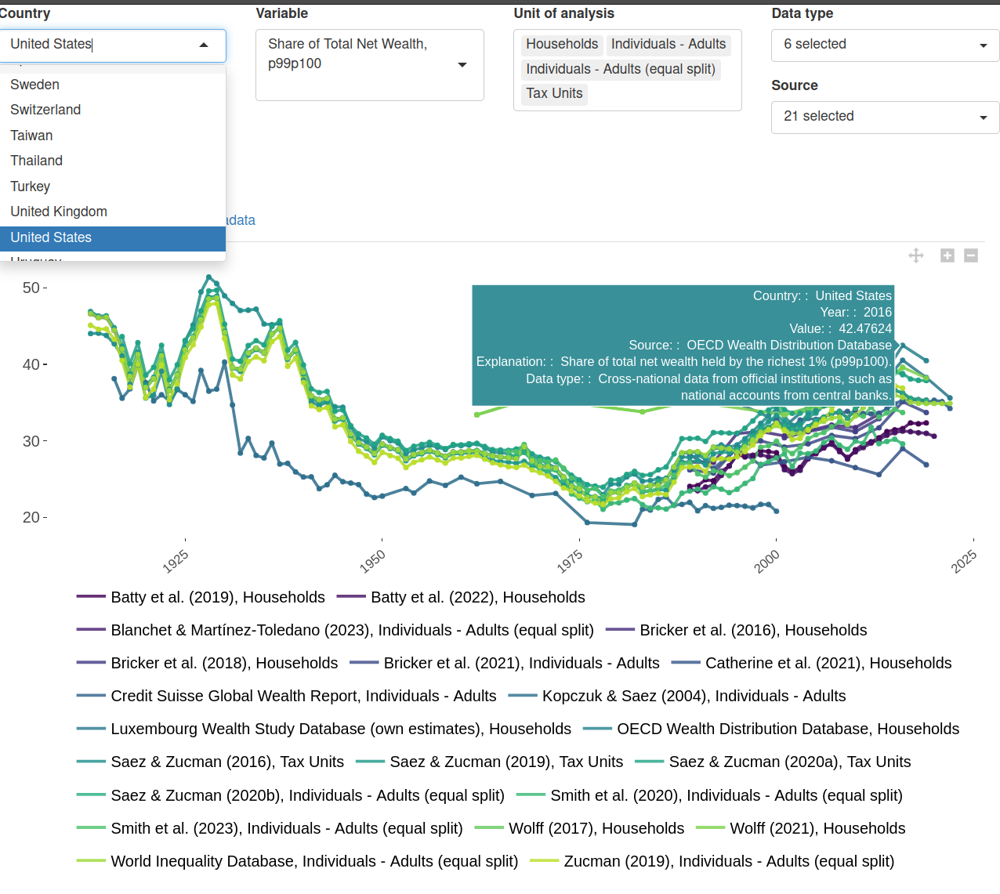
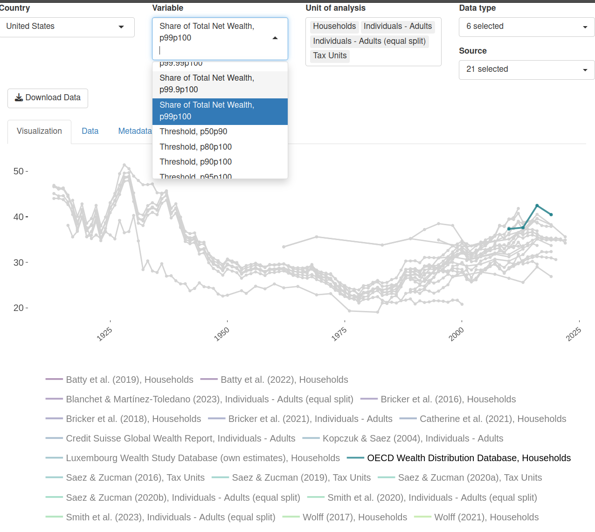

# Data Showroom

`data-showroom` is a configurable Shiny app for turning tabular datasets into reusable, website-friendly interactive dashboards. The app is designed around YAML configuration files, so most new dashboards can be created by swapping data sources, selectors, plot settings, and metadata tables without rewriting the UI.

It is especially geared toward the GC Wealth Data Warehouse ecosystem, but the app itself is more general: it can read `.csv`, `.rds`, and `.qs` datasets, layer in custom preprocessing scripts, and render plots, tables, downloads, and metadata panels from configuration alone.

## What the app supports

- Config-driven dashboards via files in `yaml/`
- Multiple plot modes: line, point, step, area, choropleth map, and animated horizontal bar charts
- Fixed selectors and reactive "loose" selectors generated from data columns
- Optional faceting, extra overlay layers, and area stacking toggle
- Downloadable filtered data tables
- Optional methodological/metadata tables shown in a tab or below the chart
- Embedded mode with JavaScript message listeners for external control

## Screenshots

<div align="center">
  
  
</div>

## Repository layout

```text
.
├── app.R                  # Shiny entrypoint; selects which YAML preset to run
├── bin/viz                # Preview/deploy command wrapper
├── tools/viz/             # Preview/deploy tooling
├── modules/               # Core app modules
├── yaml/                  # Dashboard presets
├── custom_code/           # Optional dataset-specific wrangling scripts
├── data/                  # Input data and generated artifacts
└── screenshots/           # README images
```

## Quick start

### 1. Install R packages

There is no `renv` or package manifest in this repo yet, so dependencies are managed manually. For the app and local preview tooling, install at least:

```r
install.packages(c(
  "bslib",
  "data.table",
  "DT",
  "ggplot2",
  "htmltools",
  "magrittr",
  "paletteer",
  "plotly",
  "processx",
  "qs",
  "readxl",
  "rlang",
  "scales",
  "shiny",
  "shinyWidgets",
  "tictoc",
  "viridis",
  "yaml"
))
```

Some optional data-prep scripts also use:

```r
install.packages(c(
  "countrycode",
  "dplyr",
  "janitor",
  "rmapshaper",
  "rnaturalearth",
  "sf",
  "stringr",
  "tidyr",
  "zoo"
))
```

### 2. Choose a dashboard preset

Set the preset via environment variable before launching:

```r
Sys.setenv(DATA_SHOWROOM_GRAPH = "topo_single")
```

The app loads `yaml/config_<graph>.yaml`.

### 3. Run the app

From the repository root:

```r
shiny::runApp(".")
```

## Included presets

The shipped configs fall into three families:

- `topo_*`: wealth composition / balance-sheet style dashboards
- `ineq_*`: wealth inequality dashboards
- `eigt_*`: estate/inheritance/gift tax dashboards

Examples:

- `topo_single`: single-country area chart with metadata tab
- `topo_multi`: multi-country faceted area chart
- `topo_source`: compare sources side by side
- `topo_prev` and `ineq_prev`: compact embedded versions with hidden selectors and JS listening enabled
- `eigt_wm1`: choropleth map
- `eigt_wm2`: animated horizontal bar chart

## Data availability in this repo

The app expects local data artifacts for the shipped presets. Depending on the
checkout, large/generated files may be ignored and need to be rebuilt locally:

- `data/topo_base.qs`
- `data/topo_conversion_bundle.qs`
- `data/topo_metadata_bundle.qs`
- `data/currency_conversion_bundle.qs`
- `data/taxw_wide.qs`
- `data/taxw_ft_wide.qs`
- `data/topo_warehouse_meta_v1_2.csv`
- `data/ineq_warehouse_meta_v1_2.csv`
- `data/taxw_wm_ready.qs`
- `data/taxw_wm2_ready.qs`
- `data/taxw_us_state_long.qs`
- `data/taxw_us_state_ft_wide.qs`
- `data/methodological_table.xlsx`
- `data/dictionary.xlsx`
- `data/supplementary_var_long.csv`

The `eigt_wm1` config uses the prepared `data/taxw_wm_ready.qs` artifact. The `eigt_wm2` config uses `data/taxw_wm2_ready.qs`, which retains general-government revenue rows for the animated bar chart. The `eigt_us*` configs use the US-state artifacts. Other `eigt_*` configs reference additional files such as `data/taxw_wide_viz.csv` and `data/taxw_warehouse_meta_v1_2.csv`, which are not currently committed here. Those presets will need the missing source data before they can run.

## How configuration works

Each preset is a YAML file loaded by [`modules/load_config.R`](modules/load_config.R), then passed into [`createViz()`](modules/createViz.R).

Common keys:

| Key | Purpose |
| --- | --- |
| `data.file` | Main dataset (`.csv`, `.rds`, or `.qs`) |
| `data.encoding` | Optional CSV text encoding passed to `fread`; defaults to `UTF-8` |
| `meta.file` | Optional metadata table (`.xlsx`, `.xls`, or `.qs`) |
| `data.wrangler` | Optional R script that mutates `data` after load |
| `gopts` | Plot mode(s), for example `line`, `point`, `area`, `map`, `bar`, `hbar`, `animate`, `step` |
| `axis_vars` | X/Y variable definitions, labels, and optional axis choices |
| `color` | Color variable, legend label, palette, and grouping fields |
| `fixed_selectors` | Main selectors shown on load |
| `loose_selectors` | Selectors whose choices react to the current filtered data |
| `dt.cols` | Columns shown in the data table and their labels |
| `tooltip_vars` | Variables shown in plot hover text |
| `dual_axis_options` | Optional compact hover and duplicate-metric rules for `dual_axis_line` plots |
| `facet_var` | Optional faceting variable |
| `extra_layer` | Optional overlay series such as a net wealth line on top of stacked areas |
| `overlap_offset` | Optional visual-only line/step offset for separating overlapping series; defaults to disabled |
| `download.button` | Show a CSV download button for filtered data |
| `download.cols` | Extra provenance columns retained in filtered CSV downloads |
| `table.display` | Show the data table tab |
| `hide.selectors` | Hide controls, useful for embedded views |
| `listen` | Listen for external JavaScript messages |
| `meta.loc` | Show metadata in a tab or below the visualization |

### Minimal example

```yaml
data.file: "data/ineq_warehouse_meta_v1_2.csv"
data.wrangler: "custom_code/dictionary_loader_ineq.R"

new.cols:
  var_per:
    - "d3_vartype_lab"
    - "percentile"

gopts:
  - "line"
  - "point"

axis_vars:
  x_axis:
    var: "year"
    label: "Year"
    breaks: 10
  y_axis:
    var: "value"
    label: "Value"

color:
  var: "legend"
  label: "Source"

fixed_selectors:
  GEO_long:
    label: "Country"
    selected: "United States"
  var_per:
    label: "Variable"
    selected: "Share of Total Net Wealth, p99p100"

loose_selectors:
  Data_Type:
    label: "Data type"
    type: "checkbox"

tooltip_vars:
  GEO_long: "Country:"
  year: "Year:"
  value: "Value:"
  legend: "Source:"

dt.cols:
  GEO_long: "Country"
  year: "Year"
  value: "Value"
  legend: "Source"

table.display: true
download.button: true
```

Loose checkbox selectors may set `select: first` to select only the first
available value initially and whenever a reactive refresh reapplies the
selection rule. An explicit `selected` value takes precedence on initial load.

Selector controls can also be shown conditionally from axis selections:

```yaml
loose_selectors:
  revenue_tax_category:
    label: "Revenue category"
    type: "very reactive checkbox"
    select: "first"
    visible_when:
      any:
        y_axis: ["revenu", "prorev", "revgdp"]
        y2_axis: ["revenu", "prorev", "revgdp"]
```

Within `visible_when`, `any` displays the selector when any listed input matches
one of its values. `all` requires every listed input to match; when both groups
are present, both groups must pass. Input names refer to Shiny input IDs such as
`x_axis`, `y_axis`, and `y2_axis`. Selectors without `visible_when` retain their
existing unconditional display behavior.

Dual-axis charts can opt into a compact unified tooltip and prevent the same
metric from being selected on both axes:

```yaml
dual_axis_options:
  prevent_duplicate_metrics: true
  hover:
    mode: "compact"
    context_vars:
      GEO_long:
        label: "Country"
      tax_type_view:
        label: "Type of tax"
        show_for: ["toprat", "exempt"]
```

Compact hover mode shows the unified x value once, formats each active metric
with its axis number format, and appends applicable context once. A context
entry without `show_for` is always included; otherwise it is included when
either active metric is listed. Configurations without `dual_axis_options`
retain the existing dual-axis behavior.

Line and step charts can opt into visual-only offsets for overlapping series:

```yaml
overlap_offset:
  enabled: true
  amount: 0.006
  axis: "y"
  mode: "group_index"
```

The `amount` is a fraction of the current y-range. Tooltips, tables, and
downloads continue to use the original data values.

## Extending the app

### Add a new dashboard

1. Start from one of the files in `yaml/`.
2. Point `data.file` to your dataset.
3. Add a `data.wrangler` script in `custom_code/` if the raw data needs reshaping.
4. Update `graph` in [`app.R`](app.R) to your new config name.
5. Run `shiny::runApp(".")`.

### Add preprocessing logic

Dataset-specific transformations live in `custom_code/` and are sourced after the dataset is loaded into a `data` object. Current examples include:

- [`custom_code/dictionary_loader_ineq.R`](custom_code/dictionary_loader_ineq.R): enriches inequality data with source metadata from the dictionary workbook
- [`custom_code/prepare_topo_bundle.R`](custom_code/prepare_topo_bundle.R): builds the compact lazy topo base, conversion bundle, and metadata bundle used by `topo_*` presets
- [`custom_code/prepare_currency_bundle.R`](custom_code/prepare_currency_bundle.R): builds the shared CPI/exchange-rate bundle used by lazy currency-column transforms

### Supported data/model flow

At runtime, the app follows this pipeline:

1. Load packages and source modules from `modules/`
2. Read a YAML preset
3. Load only the needed columns from the configured dataset
4. Run optional custom wrangling or lazy value transforms
5. Build selectors and reactive filters
6. Render plotly charts, data tables, download handlers, and optional metadata tables

Topo presets use `value_transform: currency_unit`, which reads
`data/topo_base.qs` plus `data/topo_conversion_bundle.qs` and materializes only
the selected currency/unit view at runtime. Rebuild those ignored deployment
artifacts with:

```bash
Rscript custom_code/prepare_topo_bundle.R
Rscript custom_code/tests/check_topo_lazy_equivalence.R
```

EIGT fiscal-threshold presets use the filtered `data/taxw_ft_wide.qs`
artifact and `value_transform: currency_columns` to materialize
selected-currency bracket bounds at runtime from
`data/currency_conversion_bundle.qs`. Rebuild and check those ignored
artifacts with:

```bash
Rscript custom_code/data_prep_eigt_wide.R
Rscript custom_code/prepare_currency_bundle.R
Rscript custom_code/tests/check_eigt_ft_currency_equivalence.R
```

## Deployment

Deployment targets are defined once in [`yaml/deploy_targets.yaml`](yaml/deploy_targets.yaml):

- target ID
- `graph` (runtime config key, mapped to `yaml/config_<graph>.yaml`)
- shinyapps app name
- profile/account label (used automatically for deployment account selection)
- optional `server` (defaults to `shinyapps.io`)
- explicit auth script path
- optional tags and enabled flag

Use [`bin/viz`](bin/viz) with selectors. Preview is the default action:

```bash
bin/viz target inhe_multi
bin/viz target eigt-kf2,eigt-wm2
bin/viz target eigt-kf2, eigt-wm2
bin/viz target eigt-kf2 target eigt-wm2
bin/viz profile gregcull
bin/viz tag topo
bin/viz all
bin/viz profile hubquin tag eigt dry-run
bin/viz target inhe_multi preview-port 8767
bin/viz tag topo yes
```

Add the repo's `bin` directory to your `PATH` if you want to run `viz` from anywhere:

```bash
export PATH="/path/to/data-showroom/bin:$PATH"
```

You can also install a launcher into a local bin directory:

```bash
bin/viz install
```

By default this writes `~/.local/bin/viz`, creating `~/.local/bin` if needed. The installed command is only a small launcher that points back to this checkout, so pulling repo updates or editing `tools/viz/` updates the installed `viz` immediately. Re-run `viz install` only if you move the repo or want to change the install location/name.

Useful install options:

```bash
bin/viz install prefix ~/.local
bin/viz install prefix /tmp/data-showroom-tools name data-viz
viz uninstall
viz uninstall prefix /tmp/data-showroom-tools name data-viz
```

The launcher stores the absolute repo root at install time. If the checkout moves, the installed command exits with a message asking you to reinstall from the new location. `uninstall` only removes a launcher created by this checkout unless you add `force`.

Deploy with the same selector syntax by adding `deploy` at the end:

```bash
viz target inhe_multi deploy
viz tag topo deploy
viz profile hubquin tag eigt deploy
viz all deploy
```

Deployments run sequentially and continue on errors. The command prints a final success/failure summary.
For bulk deployments, failed target IDs and errors are summarized after each attempt. In an interactive terminal, the command uses an arrow-key menu to retry only the failed targets or stop.
Deploy calls use `forceUpdate = TRUE`, so existing apps with the same `app_name` are updated in place.
Selectors (`target`, `profile`, and `tag`) accept comma-separated values with or without spaces, or repeated selectors. Bulk selectors (`all`, `profile`, and `tag`) only select enabled targets; an explicit `target` can still name a disabled target for intentional one-off deploys.
Use `dry-run` to inspect the selected targets, data actions, and bundle contents without copying, generating, previewing, or deploying files. Preview and deploy prompt before stale cached files/artifacts are reused; pass `refresh-data` to refresh all stale dependencies or `use-cache` to reuse them without prompting. Refresh/cache flags apply to preview/deploy runs, not dry runs. Bulk preview works with the same selectors as deployment; if more than five targets match, the CLI prompts before starting them, and `yes` skips that prompt. Add `preview-port 8767` to choose the first local port, or `no-browser` to print URLs without opening browser tabs.

Run `viz target` to choose an available target from an arrow-key menu. Run `viz tag` to choose from available tags. Press Enter to run the highlighted choice, or Escape to cancel.

Dashed options still work for compatibility, so `viz --target inhe_multi --no-browser` is equivalent to `viz target inhe_multi no-browser`.

Credential files in `auth/` are not committed, so each profile used in the registry must exist locally for deployment. Local preview does not require credential files.

### Deploy from RStudio Console

If you want to use the helper functions from the R console, source the `viz` entrypoint. It does not auto-run when sourced:

```r
source("tools/viz/entrypoint.R")

# List deployable targets (IDs are what you type to deploy)
list_deploy_targets()

# Deploy one app by name
deploy_by_target("inhe_multi")

# Deploy multiple by name
deploy_by_target(c("inhe_single", "inhe_multi"))
deploy_by_target("eigt-kf2, eigt-wm2")

# Preview selection without deploying
deploy_by_target("inhe_multi", dry_run = TRUE)

# Render deployment bundles locally without deploying
preview_by_target("inhe_multi")
preview_by_target(c("inhe_single", "inhe_multi"))

# Or through the deploy helper
deploy_by_target("inhe_multi", preview = TRUE, preview_port = 8767)
```

## Current limitations

- There is no `renv.lock`, `DESCRIPTION`, or other formal dependency manifest yet.
- Deployments depend on local credential files in `auth/`.
- Some presets depend on datasets that are not included in the repository.
- Deployment credentials are expected from an untracked local file.

## Suggested next improvements

- Add `renv` for reproducible package management
- Document each preset with a one-line purpose note inside `yaml/`
- Add a small fully self-contained demo dataset/config for first-time users
